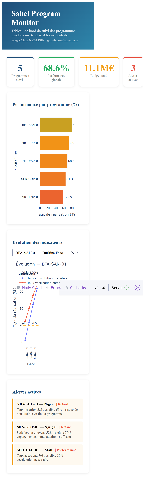

# sahel-program-monitor 📊

> Tableau de bord interactif de suivi des indicateurs de performance
> des programmes de développement au Sahel — PostgreSQL & Dash

Développé par **Serge-Alain NYAMSIN** - Expert Évaluation & Data Science  
🔗 [github.com/sanyamsin](https://github.com/sanyamsin)

---

## 🎯 Objectif

Ce projet simule un système complet de **suivi des indicateurs de performance**
de 5 programmes de coopération au développement financés par LuxDev
au Sahel et en Afrique centrale.

Il démontre comment une base de données PostgreSQL combinée à un dashboard
interactif Dash/Plotly peut transformer le suivi MEL traditionnel en un
outil de pilotage en temps réel.

---

## 🗂️ Structure du projet

    sahel-program-monitor/
    ├── sql/
    │   ├── sahel_monitor_dump.sql    # Structure et données PostgreSQL
    │   └── queries_suivi.sql         # Requêtes analytiques avancées
    ├── scripts/
    │   └── dashboard.py              # Dashboard interactif Dash/Plotly
    ├── reports/                       # Exports et rapports
    ├── requirements.txt
    └── README.md

---

## 🗄️ Base de données PostgreSQL

### Tables
| Table | Description |
|-------|-------------|
| `programmes` | 5 programmes actifs (Niger, Mali, Burkina, Sénégal, Mauritanie) |
| `indicateurs` | 11 indicateurs de performance avec cibles et baselines |
| `mesures` | 30 mesures de suivi périodique (2021-2024) |
| `alertes` | Système d'alertes automatiques sur les dérives |

### Requêtes analytiques
- Tableau de bord global des programmes
- Progression des indicateurs avec statut (sur la bonne voie / attention / retard)
- Évolution temporelle avec fonctions de fenêtre SQL (`LAG`, `ROW_NUMBER`)
- Alertes actives et programmes à risque
- Analyse budgétaire par secteur

---

## 📈 Dashboard interactif

Le dashboard Dash/Plotly offre :
- **4 KPI cards** : programmes, performance globale, budget, alertes
- **Graphique de performance** par programme avec code couleur
- **Évolution temporelle** filtrable par programme
- **Alertes actives** avec détail des messages

## Aperçu



---

## 🌍 Programmes suivis

| Code | Pays | Secteur | Budget | Performance |
|------|------|---------|--------|-------------|
| BFA-SAN-01 | Burkina Faso | Santé | 3.2M€ | 80.2% |
| NIG-EDU-01 | Niger | Education & Emploi | 2.5M€ | 72.2% |
| MLI-EAU-01 | Mali | Eau & Assainissement | 1.8M€ | 68.8% |
| SEN-GOV-01 | Sénégal | Gouvernance | 1.5M€ | 64.3% |
| MRT-ENV-01 | Mauritanie | Environnement | 2.1M€ | 57.6% |

---

## 🛠️ Technologies utilisées

- **PostgreSQL 17** - Base de données relationnelle
- **Python 3.12** - Pipeline et dashboard
- **Dash / Plotly** - Visualisation interactive
- **psycopg2** - Connecteur Python-PostgreSQL
- **SQL avancé** - Fonctions de fenêtre, CTEs, agrégations

---

## 🚀 Reproduire le projet

```bash
# 1. Cloner le repo
git clone https://github.com/sanyamsin/sahel-program-monitor.git
cd sahel-program-monitor

# 2. Créer l'environnement virtuel
python -m venv venv
source venv/Scripts/activate  # Windows
source venv/bin/activate       # Linux/Mac

# 3. Installer les dépendances
pip install -r requirements.txt

# 4. Créer la base PostgreSQL
psql -U postgres -c "CREATE DATABASE sahel_monitor;"
psql -U postgres -d sahel_monitor -f sql/sahel_monitor_dump.sql

# 5. Lancer le dashboard
python scripts/dashboard.py

# 6. Ouvrir dans le navigateur
# http://localhost:8050
```

---

## 🌍 Pertinence pour la coopération au développement

Ce système répond à un besoin concret des agences de développement :
disposer d'un outil de pilotage en temps réel des indicateurs de performance
sur un portefeuille multi-pays et multi-secteurs — remplaçant les tableaux
Excel statiques par un dashboard dynamique connecté à une base de données.

---

## 👤 Auteur

**Serge-Alain NYAMSIN**  
MSc Data Science & AI - DSTI Paris  
12+ ans en coopération au développement (Sahel, Afrique centrale)  
🔗 [github.com/sanyamsin](https://github.com/sanyamsin)

---

*Ce projet illustre comment PostgreSQL et Python peuvent moderniser
le suivi-évaluation dans la coopération au développement.*